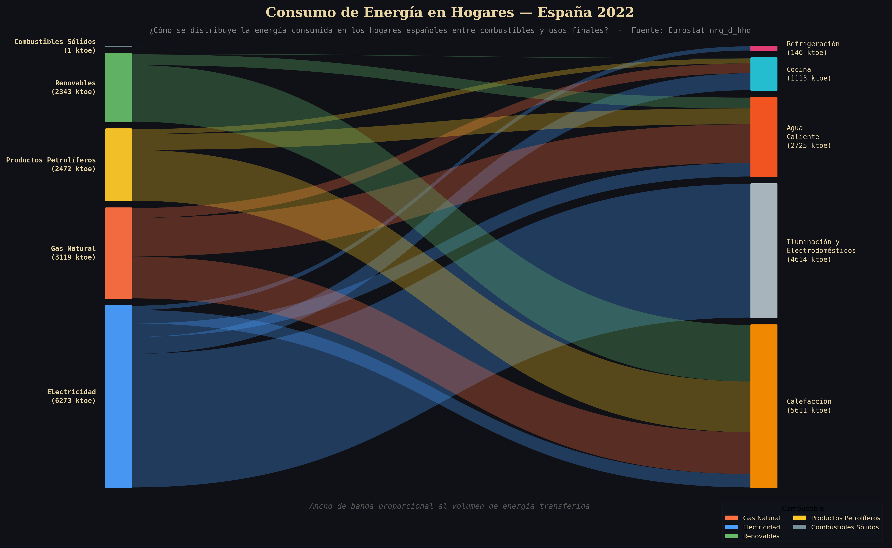
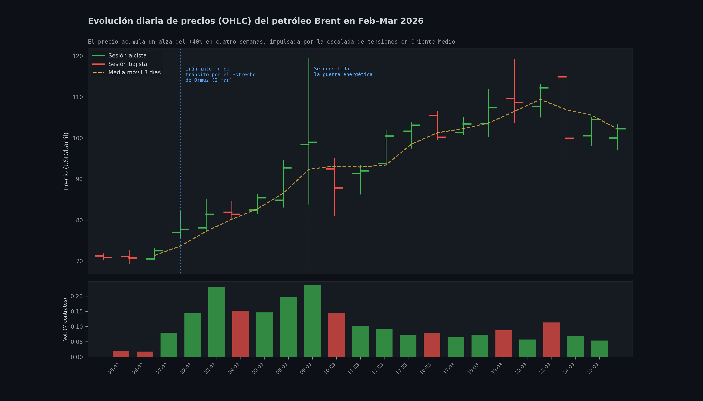
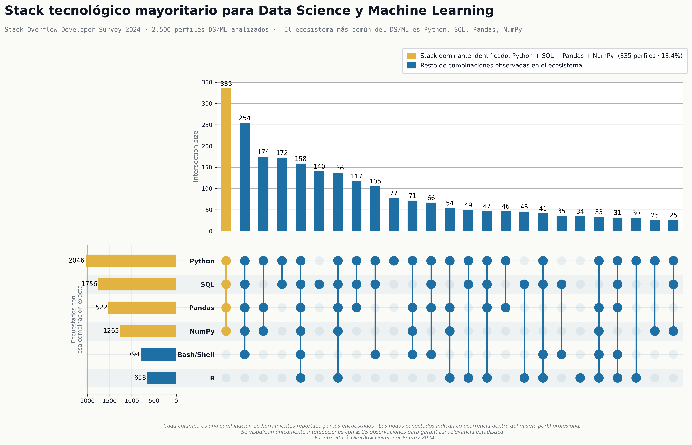

# PEC 2 Visualización de datos

## TÉCNICA GRUPO I (Básicas y populares): Sankey Diagrams

¿Cómo se reparte el consumo energético doméstico entre distintas fuentes y en qué usos finales se concentra principalmente?

¿Cómo evoluciona el precio del Brent en el tiempo y qué relación existe entre los movimientos de mercado y eventos externos geopolíticos?

El diagrama de Sankey representa cómo se distribuye el consumo de energía en los hogares españoles relacionando las guentes energéticas con los usos finales.

Este gráfico OHLC muestra la evolución diaria del precio del petróleo Brent, incluyendo apertura, máximo, mínimo y cierre, junto con el volumen negociado.

## TÉCNICA GRUPO II (Habituales y específicas): OHLC Charts

## TÉCNICA GRUPO III (Menos habituales o específicas): UpSet: Visualizing Intersecting Sets

¿Qué combinaciones de herramientas son más frecuentes en el ecosistema DS/ML y cuál es el stack tecnológico dominante?

Este gráfico UpSet analiza las combinaciones de herramientas utilizadas por profesionales de Data Science y Machine Learning, mostrando tanto la frecuencia de cada herramienta como las intersecciones más comunes entre ellas. Se destaca el stack dominante dentro del ecosistema.

---

**Autor**: Ricard Santiago Raigada García

**Fecha**: 27/03/2026
